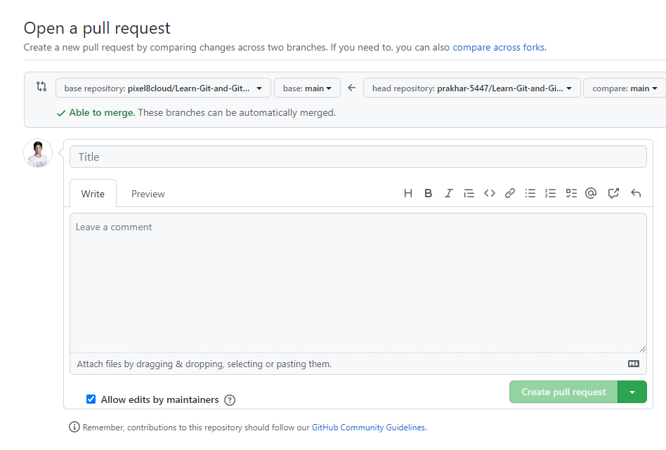

<h2>Why we need to clone ?</h2>

To contribute to someone's project or repository, you need to clone his repository (repo). In simple words clone means copy.

<h2>How to clone a repository</h2>
<ul>
  <li><b>Open the repository you want to copy</b></li>
  <li><b>Fork the repository by clicking the option in <i>Top Right Corner</i></b></li>
  <li><b>Now,Copy the link</b></li>
  
  <li><b>Open Git Bash in your computer</b></li>
  <li><b>and Run <kbd>git clone {<i>paste_link_here</i>}</kbd></b></li>
  <li><b>open the folder in VS Code and make changes</b></li>
  <li><b>Now, Run<kbd>git add {file_name}</kbd> to staged the changes</b> Note: all changes are marked as unstaged</li>
  <li><b>Run <kbd>git commit -m"{commit_message_here}"</kbd>to commit and write a short description about the changes</b></li>
  <li><b>then, Run<kbd>git push</kbd> to push changes to your Github Repository</b></li>
  <li><b>In the repository you will see <i>Pull Request</i> section</b></li>
  <li><b>Now, click on create pull request</b></li>
  
  <li><b>Write title, description & create Pull Request</b></li>
  
</ul>
