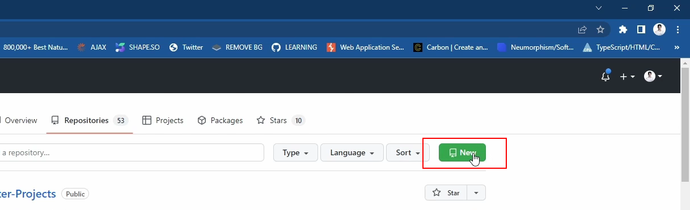
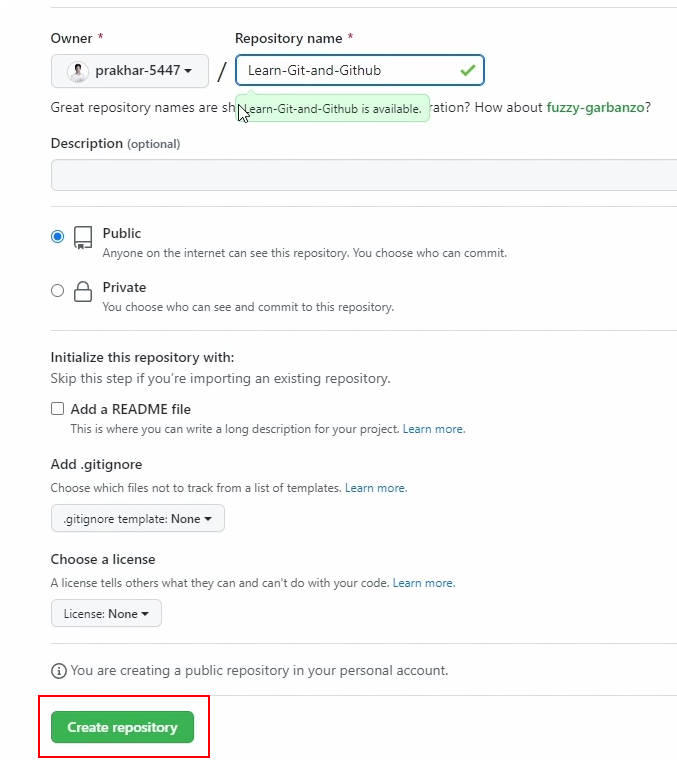
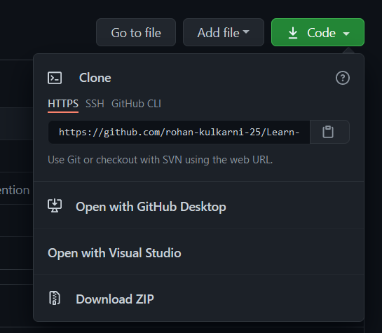

<h2>Getting started with Git and GithHub</h2>

You will find <a href="https://github.com/prakhar-5447/Learn-Git-and-Github/tree/main/Introduction">Introduction to Git and GitHub</a> in this first section of this repository. Let's start with Downloading <a href="https://git-scm.com/downloads">Git</a>.then , install git to your preferred location. and type
<kbd>git --version</kbd> to check whether it installed correctly or not.

<h2>Config Git</h2>
Run this commands to configure git
<ul>
  <li><kbd>git config --global --user.name {<i>YOUR_GITHUB_USERNAME</i>}</kbd></li>
  <li><kbd>git config --global --user.email {<i>YOUR_EMAIL</i>}</kbd></li>
</ul>

<h2>Create Repository</h2>
Step to create your first repository<ul>
  <li><b>Open your GitHub</b></li>
  <li><b>Click on Create New Rpository</b></li>
  
   <li><b>Name the Repo and create repository</b></li>
  
  <li><b>Copy the link</b></li>
  
  <li><b>Create a empty folder in your computer</b></li>
  <li><b>Open folder in VS Code</b></li>
  <li><b>Run <kbd>git init</kbd> which initialize this folder as git repostiory</b></li>
  <li><b>Now make a file README.md and write something about this project or repository</b></li>
  <li><b>Run<kbd>git add {file_name}</kbd> to staged the changes</b> Note: all changes are marked as unstaged</li>
  <li><b>Run <kbd>git commit -m"{commit_message_here}"</kbd>to commit and write a short description about the changes</b></li>
  <li><b>Now, Run<kbd>git branch -M main</kbd>to create a branch</b></li>
  <li><b>Run <kbd>git remaote add origin "{paste_url_of_repository}"</kbd>to commit and write a short description about the changes</b></li>
  <li><b>Now, Run<kbd>git push -u origin main</kbd> to push this changes to GitHub</b></li>
</ul>
